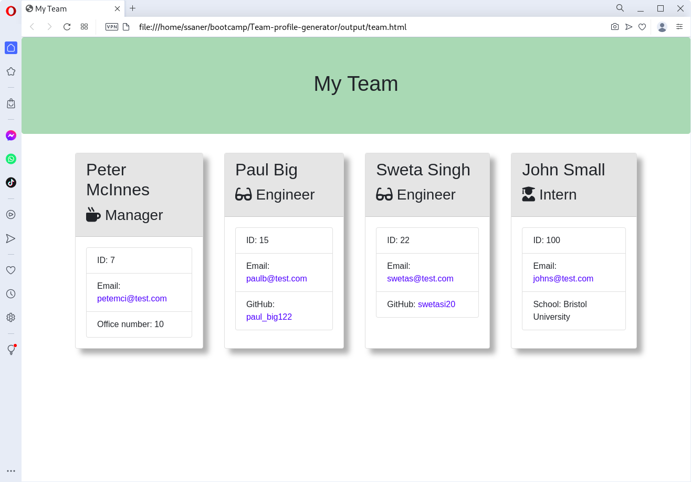
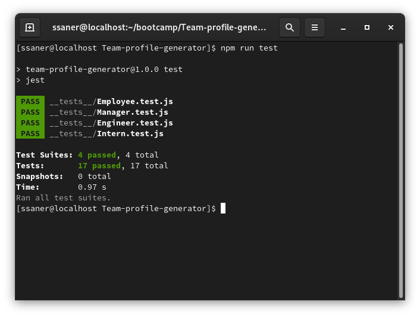

# Project Title: Team Profile Generator

[](https://opensource.org/licenses/MIT)

## Description

This applicationon collects basic data about employees of a software engineering team, then it generates an HTML webpage that displays summaries for each person.


## Table of Contents
- [Description](#description)
- [Installation](#installation)
- [Usage](#usage)
- [Screenshot](#screenshot)
- [Licence](#licence)
- [Contributing](#contributing)
- [Tests](#tests)
- [Questions](#questions)

## Installation

The application is driven from a command line using Node.js. If you do not have node.js installed, please refer to Node.js installation instructions relevant for your operating system.

Clone the application from this repo to your local system:

```
git clone https://github.com/stansaner/Team-profile-generator
```

Then change directory to the cloned repo.

The Team Profile Generator application also relies on inquirer package.

Make sure that your cloned repo includes a package.json with the required dependencies. You can create one by running from the cloned repo directory:

```
npm init
```

before installing any dependencies. To install the inquirer package, from the cloned repo directory run:

```
npm install inquirer@^8.0.0
```

Your environment should be ready to run the application now.


## Usage

 To start the application, run in the top directory of your cloned repo:

```
node index.js
```

The application will ask series of questions expecting one-line asnwers.

First the application prompts to enter the team manager's:
- Name
- Employee ID
- Email address
- Office number

This is then followed by a menu with the option to:
- Add an engineer
- Add an intern
- Finish adding team members

When a user selects the engineer option then a user is prompted to enter the following:
- Engineer's Name
- ID
- Email
- GitHub username

and then the user is taken back to the menu.

When a user selects the intern option then a user is prompted to enter the following:
- Intern's name
- ID
- Email
- School

and then the user is taken back to the menu.

When a user decides to finish building their team the the HTML file is generated and the application exits.

The resulting webpage is placed in the **output** directory (the directory is created if it does not exist already) in the file named **team.html**.

In addition, a template CSS style file **style.css* is also copied to the output directory. The user is free to modify the styles to his liking or just leave the styling in the template form.


## Screenshot




## Output File Example

[Output File](./assets/team.html)


## Licence

MIT

## Contributing

Please refer to the Questions section if you would like to make any changes to this application.


## Tests

The application is provided with a test suite that checks validity of the data objects used to collect personal information about the team members against the expectations of the HTML code generator.

As an example how to run the tests using **jest** package, perform the following:

Install the jest package:

```
npm install jest -D
```

Edit **package.json** file and in the debug scripts section, change it to:

	test: "jest"

Then run the test:

```
# npm run test
```

The result should be a "pass" for all items and it should look like this:




## Questions

For more questions please visit:
[https://github.com/stansaner](https://github.com/stansaner)

or send an email to: stan.saner@hotmail.co.uk

      